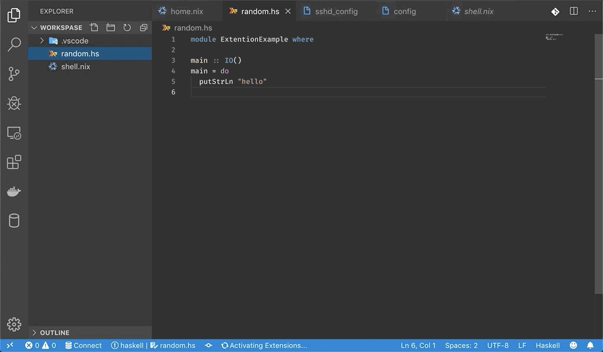

# Nix Environment Selector (🧪 *Experimental Release*)


The extension allows you switch environment for Visual Studio Code and extensions based on `.nix` config files.

## Motivation

Nix package manager provides a convenient solution for creating isolated environments with a specific configuration of packages. This way is working from the command line as well, but not prepared for using with IDE. For example, if you have a language server extension requires a compiler installed inside an isolated environment there is no simple way to link 'em with each other. The solution allows you to manage the environment for projects based on Visual Studio Code workspace.

## Getting started

* First of all, you should install [Nix package manager](https://nixos.org/nix/).
* [Install the extension](https://marketplace.visualstudio.com/items?itemName=arrterian.nix-env-selector)
* Prepare your nix env config with extension `.nix` and place in your project workspace.

> You can set non-workspace located file but in this case, you should set full path into parameter `"nixEnvSelector.nixShellConfig"` in your config.

* Type `"Select environment"` in command pallet

## Haskell Project running example

To run your Haskell application you have to install `GHC compiler`. To avoid global GHC instalation and be able to use different compiler versions in your host let's do this by using `nix` virtual environment

Example of GHC compiler inside the NIX store(`shell.nix`):

```nix
{ nixpkgs ? import <nixpkgs> {} }:
let
  inherit (nixpkgs) pkgs;
  inherit (pkgs) haskellPackages;

  haskellDeps = ps: with ps; [
    base
    lens
    mtl
    random
  ];

  ghc = pkgs.haskell.packages.ghc864.ghcWithPackages haskellDeps;

  nixPackages = [
    ghc
    pkgs.gdb
    haskellPackages.cabal-install
  ];
in
pkgs.stdenv.mkDerivation {
  name = "snadbox-haskell-workspace";
  buildInputs = nixPackages;
}
```

Now let's try to open our project in Visual Studio Code.



You can see, IDE can't find a compiler. Let's turn on `shell.nix` env.


Bingo 🎉🎉🎉. Everything is fine now 😈

## Supported Platforms

* MacOS

The extension Should work on the Linux platform as well, but not tested yet. Feel free to create an issue if you found a problem.

## License

[MIT](LICENSE)

